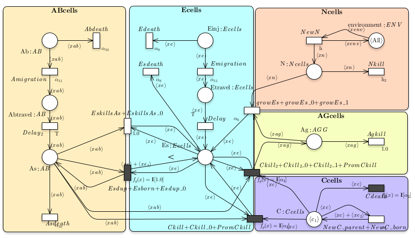
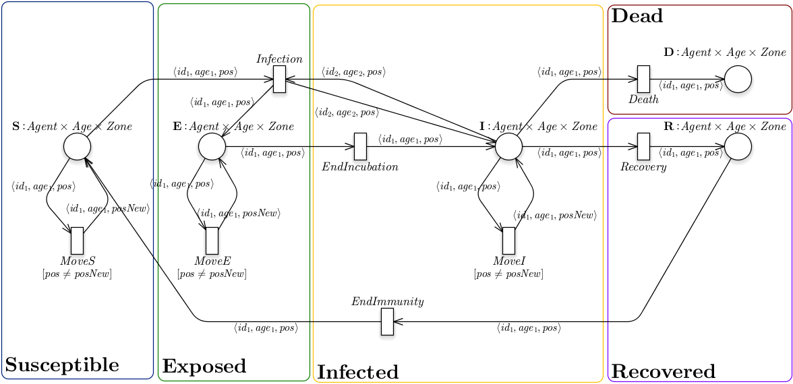

# AB-ESSN
In  this  github page we show how the **GreatMod** framework can be efficiently exploited to define model by exploiting the both the extended stochastic symmetric net (ESSN) and agent based model (ABM)  formalisms. The potentiality of the approach is showed through two case studies: 

1. using the AB-ESSN translation for the realization of  computational epidemiology model;
2. exploiting a compositional approach for the definition of a computational immunology model.

We exploit the framework, called GreatMod, developed by [q-Bio group](https://qbio.di.unito.it/) for  the  analysis  of  biological  and  epidemiological  systems. All the details regarding the framework, and the R package *epimod*, can be found at the following link: [GreatMod](https://qbioturin.github.io/epimod/). 
In particular, the installation of the workflow and the opening of the Petri Net models requires to download the last version of the [GreatSPN](https://github.com/greatspn/SOURCES/blob/master/docs/INSTALL.md) editor.

## Supplementary materials
Supplementary file for manuscript:
From compositional Petri Net modeling to macro and micro simulation by means of Stochatic Simulation and Agent-Based models
by
ELVIO AMPARORE, MARCO BECCUTI, PAOLO CASTAGNO, and SIMONE PERNICE, GIULIANA FRANCESCHINIS and MARZIO PENNISI
accepted for publication on 
ACM Transactions on Modeling and Performance Evaluation of Computing Systems

The file contains additional details about the translation algortihm from ESSN to NetLogo format and some considerations about the correctness of the translation. 

### Annex 1

### SEIR model 

#### SSA folder

In this folder all the files necessary to reproduce the simulation of the SEIRS model are reported:
  
  1. the *main.R* file reports all the steps to run the SSA algorithm to simulate the model, 
  2. the *Plot&Test.R* reports the commands to generate the images and to run the statistical tests.

#### ABM folder

In this folder all the files necessary to reproduce the simulation of the SEIRS
obtained using the ABM are reported.

### Melanoma model


<p class="caption">
Fig.1) AB-ESSN composed model of Immune system and Melanoma cells behavior.
</p>

This case study is inspired by the ordinary differential equations (ODEs) model presented in this [work](https://pubmed.ncbi.nlm.nih.gov/22701144/).
Such model reproduced the immune response stimulated by OT1 activated cytotoxic T cells with Anti-CD 137 immunostimulatory monoclonal antibodies against melanoma,  one of the most aggressive malignant tumors.

The composed, decolored models and the subnets necessary for the composition are all stored in the PNPRO file in *Melanoma/SSA/Net* folder.

#### SSA folder

In this folder all the files necessary to reproduce the simulation of the Melanoma model. In particular
  
  1. *Main.R* reports all the steps to run the SSA algorithm starting from the decolored model 
  2. *Rfunction/PlotsGeneration.R* reports the functions to generate the images.
  
#### ABM folder
In this folder all the files necessary to compose the final model, as well as, obtain the netlogo code for  the simulation of the Melanoma model are reported.

### Annex 2

### Automatic Netlogo Translation

<p class="caption">
Fig.2) The SEIRS ESSN model. Initial marking: N agents in place S (uniformly distributed among  |Zone| positions) and 5 agents in place I (all in the same position).
</p>

To demonstrate the feasibility of our translation approach, we implemented inside GreatSPN the automatic translation of the ESSN composed model into an Agent-Based Model that can be executed on [NetLogo ABM software](http://ccl.northwestern.edu/netlogo/).


NetLogo is considered as one of the most easy programmable modeling environments for Agent-Based Models, and therefore it is often used as the preferred tool to introduce students into the world of ABM simulation. NetLogo considers two types of agents, "turtles" and "patches". The former best suit the common definition of agents; the latter are instead special agents representing the positions of the physical space where turtles may act and interact, thus patches cannot move.

Both can posses internal variables and be in charge of executing complex rules defined by the programmer through the "ask" command. Generally, the "setup" and "go" procedures are present inside any NetLogo program. The first procedure sets up the initial conditions, and the second one includes the simulation code that is continuously iterated until a given set of conditions defined by the user is reached. Even if the standard approach for time-advancement implemented in NetLogo is the Fixed Increment Time Advance (FITA) with equally spaced time-steps managed by means of a "tick" counter, the code produced by the translation algorithm implements a NETA (Next Event Time Advance) approach on top of that according to the simulation algorithm \ref{alg:ABMsim1} defined earlier.

The translation starts with the declaration of all the defined agent classes as Netlogo turtles with the command "breed", and all the possible associated attributes with the command "\<breed\>-own". 

For instance, on the SEIRS model in Figure 2, the code for the declaration of the agent class is:
```netlogo
;; declare main agent classes
breed [People a_People]
;; Agent attributes
People-own [Zones_0 Age_0 place myrate totrate rtime] 
;; rtime variable has been added manually to exploit agent-centered measures
```

In the SEIRS example we have only one agent type (called *People*). Every agent will possess a *place* attribute, which encodes the ESSN place the agent is currently residing in (i.e., the agent state), a *myrate* list attribute to store the rates of the rules for which the agent will be the active leader, and *totrate* to store its cumulative rate. *myrate* and *totrate* are used to implement the NETA simulation algorithm. Furthermore, in this example agents also have two more custom attributes named *Zones<sub>0<sub>* and *Age<sub>0<sub>*. Such attributes, that translate the color classes *Zones* and *Age*, are used to represent agents' position and age range (i.e., young, mid, old), respectively. From the GreatSPN interface it is possible to declare the color classes associated with agents types by using the special keyword *agent* inside the class declaration (e.g., "*class* *People* = **agent** *pp*{1...100}$" will define the ids for 100 agents of type People). 

Furthermore, we note here that patches and Netlogo spatial representation are actually not considered for the moment. Their translation will be implemented in future releases. 

A global variable is defined for each Place, and a unique numerical value is associated with it in the setup procedure. Then simulation parameters are set-up and the set of initial agents (corresponding to ***m<sub>0<sub>***) is created, as shown in the following code example:
```
set delta1 0.01
...
;; place identifiers
set SS 1000     ;;susceptible place identifier
set EE 1001     ;;exposed place identifier
set II 1002     ;;infected place identifier
set RR 1003     ;;recovered place identifier
...
;; setup initial marking
  create-People 90 [ ;; 90 people
    set place SS ;;state susceptible
    set Age_0 0 ;; young
    set Zones_0 0 ;; zone 0
    set color [100 149 237] ;; random color
  ]
  create-People 10 [ ;; 10 people
    set place II ;; state infected
    set Age_0 0 ;; young
    set Zones_0 1 ;; zone 1
    set color [100 149 237] 
  ] ...
  let allAgents (turtle-set People )   ;;code added manually to inizialize
  ask allAgents [set rtime []  ]       ;;the  variable (treated as a list) for storing reinfection times
```

After such initial declarations, the annotated ESSN model is translated in NetLogo as well. Every ESSN transition $t$ is associated with a *leading agent* chosen among the agents associated to the variables on the input arcs of *t*.

In the main loop (the *to go* procedure), each transition *t* is translated into an agent rule by using two separate code segments. In the first code segment the rule rate for each agent is calculated. For simple transition rules (i.e., rules that involve only one agent) the rate calculation is trivial and it is directly obtained by the transition rate. For interaction rules (i.e., rules that involve more than one agent) each active agent needs to know the number of possible markings (i.e., sets of passive agents it can interact with) that satisfy the guard conditions, and then this number is used for the computation of the actual transition rate.
This is calculated by means of nested loops on the participating passive agents, as shown by the following translated code of the "infection" transition from the SEIRS example [^1]

```
;; transition Infection
set _A1 People with [place = SS AND (True)] ;;Active leading agent
if any? _A1 [
  ask _A1 [
    let countInstances 0
    let p1 [who] of self        ;;saving agent identity
    let sus [Age_0] of self     ;;saving agent age
    let pos1 [Zones_0] of self  ;;saving agent position
    ;; Each agent in _A1 will select the set of compatible passive agents _A2
    let _A2 People with [place = II AND (pos1 = Zones_0)] 
    if any? _A2 [               
      ask _A2 [
        let p2 [who] of self
        let inf [Age_0] of self
        let pos2 [Zones_0] of self
        set countInstances  countInstances + 1
      ]
    ]
    ;; summing up all rates
    set myrate replace-item 9 myrate (countInstances * (infection))
  ]
]
```

Here, each active People agent with status *SS* (e.g., susceptible) will act as active leading agent by asking to People agents in $\in \_A2$ (e.g., passive agents in infected state on the same position of the leading agent) to count themselves (set countInstances countInstances + 1).
In this way, active agents belonging to the set $\_A1$ will obtain the total number of combinations[^2] of selected passive agents to calculate the total transition rate, considering only the agents that they can interact with. 
Actually, *myrate* is represented as an array of rates, and each element of the array stores the rate of a transition in which the agent is active. 

After this step, that is executed for all the agents and all the rules for which the agents are active agents, each agent will be asked to calculate its cumulative rate inside their internal variable  *myrate*, and then the total rate  *totrate* is calculated as the sum of agents' rates. Thus, the selection of the next event starts by randomly choosing the next agent that will act, taking into account the weights of the event rates[^3]. The example code for this process is reported as follows: 
```
let allAgents (turtle-set People )          ;; only  People angents can calculate their rate
ask allAgents [set totrate sum myrate]      ;; calculation of agents' total rate
set gammatot sum [totrate] of allAgents     ;; calculation of cumulative rate
if gammatot = 0 [stop]                      ;; stop if no more actions can occur
let increment ((-1 / gammatot) * ln(random-float 1)) ;; generate the random time advancement according to 
                                                the exponential distribution and the total rate
set time  time + increment                  ;; increment time
;; select the next agent that will perform an action
let chosenAgent rnd:weighted-one-of allAgents [totrate] 
```

After that, the second part of the code segment related to transitions is introduced. This code will include the effects related to the firing of the selected transition, and will be executed only by the chosen agent. Simply speaking, the next acting agent will select the next transition/rule (again with a roulette-wheel method) and will choose the passive agent(s) participating in the selected action. Finally, it will perform (or will ask to passive agents to perform) all agent feature updates according to the expressions on the transition arcs. This may lead to the following scenarios:
* An agent variable that appears both on an input and an output arcs is updated (the place is changed, its attributes are modified according to the arc function); 
* An agent variable that only appears on an output arc will lead to a newly created agent.
* An agent variable that appears in input but does not appear in output will lead to agent death.


For example, the  *infection* transition will change the state of the leading active agent $p1$ to  *EE* (e.g., exposed), but will not modify the state of the selected passive infected agent ($p2$). The example code for agent selection an infection transition/rule is reported next:
```
let bindingSelected false
  (if-else 
  is-a_People? self [
    ;; select the next action performed by the chosenAgent
    let indices  n-values (length myrate) [ i -> i ]
    let pairs (map list indices myrate)
    let nextaction  first rnd:weighted-one-of-list pairs [ [var_P] -> last var_P ]
    (
      if-else
      nextaction = 0 [ ... ] ;; other actions not related to the infection transition/action
      ....
      nextaction = 4 [
        ;; chosenAgent is leader of Infection
        let targetRate random-float (item 4 myrate)
        let p1 [who] of self
        let sus [Age_0] of self
        let pos1 [Zones_0] of self
        let _AA2 People with [place = II AND (pos1 = Zones_0)]
        if any? _AA2 [
          ask _AA2 [
            if NOT bindingSelected [
              let p2 [who] of self
              let inf [Age_0] of self
              let pos2 [Zones_0] of self
              set targetRate targetRate - (infection)
              if-else targetRate > 0 [ ]
              [
                set bindingSelected true        ;; fire this binding
                ask turtle p1 [                 ;; agent p1 is modified
                  set place EE
                  set Age_0 sus
                  set Zones_0 pos1
                  set rtime lput time rtime    ;; code added manually to update the reinfection times list 
                ]
                ask turtle p2 [                 ;; agent p2 is not modified
                ...
           
                ]
         ...         ;; here there are a series of closing brackets
      ]
```

Once the event execution is completed, the same process is repeated by asking again all agents to update their transition/action rates and then to select the next agent/event.

The generated NetLogo model will include, besides the code, some basic features such as the setup and go buttons, the possibility to select a custom stop time for the simulation (default 0; no stop) and a "random seed" input field on the model interface to select the initial random seed of the simulation. Moreover, a basic real-time plot for the cumulative number of agents of the same type and sub-classes (i.e., number of agents of the same type but in a different states) is incorporated into the model interface.

### Correctness of the translation ###
The generated ABM model is equivalent to the corresponding ESSN model it originated from as, by construction, a bijective relationship holds.

#### State bijection ####

Each ESSN subnet identifies a given agent type, the set of places within a given subnet identifies a state feature for that given agent type whose feature cardinality (i.e., number of possible values) is equal to the number of places in the subnet. The color domain of each place identifies the set of features of such agent type, including a color id that uniquely identifies tokens as agents. So, as we impose that each token must be unique (thanks to a given color id), each token will uniquely correspond to an agent. Thus, the ESSN state that is a given distribution of (colored) tokens in the places will be represented in the ABM as the union of the states of all Agents. So there is a mapping from the ABM state and the Net and vice-versa. Note here that during translation the color id is not reported as in NetLogo Agents are already unique entities with their id.

#### Transtition/rule-instance bijection ####

The ESSN state change occurs in a given state for a given enabled transition instance. Correspondingly, In the ABM a state change occurs when a rule among the enabled ones is chosen and executed. In the ABM there is one rule for each transition, and each rule has an associated leader agent and possibly other agents participating in the rule. The enabling of the rule in the ABM is checked by the leader agent, based on its state and the states of the other participating agents: in any state there is one enabled rule for each possible enabled instance of the corresponding transition and its rate is the same as that of the corresponding transition instance.
The enabled instances of the different rules are determined by iterating on each leader agent whose state satisfies the requirement for rule enabling, and in case of an interaction transition involving two or more agents, this is followed by the nested selection of other agents satisfying the enabling conditions of the corresponding ESSN transition.

The choice of the next rule application is done in a probabilistic manner driven by the rates according to 
a race conflict resolution policy and exploiting the properties of the exponential distribution. 
The application of the rule (corresponding to the firing of a transition) performs the same type of state change as that defined by the transition, hence it will reach the same new state as the ESSN. 
 

 

[^1]: The current implementation is in beta state and does not translate general laws for rates' calculations yet; these must be added manually.

[^2]: This mechanism for computing the number of combinations of passive agents that can interact with the leading agent can handle any number of passive agents and any transition guard constraining the allowed combinations, however in some cases, including the simple case illustrated in the example, it could be optimized by exploiting the agents counting functions of NetLogo.

[^3]: this result is achieved by using the NetLogo `Rnd` extension
